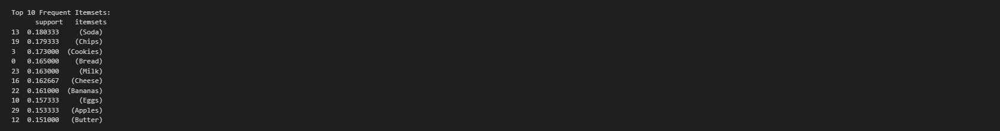

# *frequent-itemsets-group-08*
## *Table of Contents*

- [Project Overview](#project-overview)
- [Objectives](#objectives)
- [Repository Structure](#repository-structure)
- [Step 1: Generating Supermarket Transactions](#step-1-generating-supermarket-transactions)
- [Step 2: Generate Frequent Itemsets](#step-2-generate-frequent-itemsets)
- [Step 3: Identify Closed Frequent Itemsets](#step-3-identify-closed-frequent-itemsets)
- [Step 4: Identify Maximal Frequent Itemsets](#step-4-identify-maximal-frequent-itemsets)
- [Group Members](#group-members)
- [How to Run](#how-to-run)
- [Techniques Used](#techniques-used)
- [License](#license)
- [Repository Url](#repository-url)


## *Project Overview*

*This project explores customer behavior in an e-commerce domain using association rule mining techniques. Our primary goal is to uncover frequent, closed, and maximal itemsets from synthetic transaction data. The results can help e-commerce platforms identify frequently bought-together items, improve product recommendations, and enhance user experience.*

---

## *Objectives*

* *Generate and preprocess transaction data*  
* *Apply one-hot encoding for data transformation*  
* *Identify frequent itemsets using a custom implementation*  
* *Extract closed and maximal frequent itemsets*  
* *Document insights and prepare a final report*

---

## *Repository Structure*

```plaintext
frequent-itemsets-group-XX/
│
├── supermarket_transactions.csv        # Raw simulated transactions
├── frequent_itemsets.csv               # Output from Apriori (min_support=0.05)
├── closed_itemsets.csv                 # Filtered closed frequent itemsets
├── maximal_itemsets.csv                # Filtered maximal frequent itemsets
├── frequent_itemsets_analysis.ipynb    # Fully commented analysis notebook
├── README.md                           # This file

```
## *Step-1:Generating Supermarket Transactions*

*This section generates `3,000 supermarket transactions.` Each transaction includes between `2 to 7 items` randomly selected from a pool of `30 unique grocery items.` To ensure reproducibility, a random seed is set. The resulting transactions are stored in a pandas DataFrame and saved as a CSV file for future use.*

*Step 1: Simulate Supermarket Transactions*
*Items: 30 unique grocery products (e.g., Milk, Bread, Soda, etc.)*

*Transactions: 3,000 simulated purchases*

*Mechanism:*
*– 50% chance of inserting a known frequent bundle (e.g., \['Milk', 'Bread'])*
*– Add 0–4 additional random items*
*– Random order for realism*
 ### *Define Item Pool*
```python
# Generate 3000 supermarket transactions
# Each transaction will have between 2 and 7 items randomly chosen from a pool of 30 unique items
random.seed(42)
item_pool = [   # List of 30 unique grocery items
    'Milk', 'Bread', 'Butter', 'Eggs', 'Cheese', 'Apples', 'Bananas', 'Chicken',
    'Beef', 'Fish', 'Rice', 'Pasta', 'Cereal', 'Juice', 'Soda', 'Yogurt',
    'Tomatoes', 'Onions', 'Potatoes', 'Carrots', 'Cookies', 'Chips', 'Ice Cream',
    'Coffee', 'Tea', 'Sugar', 'Flour', 'Salt', 'Pepper', 'Oil'
]  

# -------------------------------  
# Step 2: Define common frequent bundles  
# -------------------------------  
frequent_bundles = [  
    ['Milk', 'Bread'],  
    ['Apples', 'Bananas', 'Yogurt'],  
    ['Chicken', 'Rice', 'Beans'],  
    ['Soda', 'Chips', 'Cookies'],  
    ['Cheese', 'Butter', 'Eggs']  
]
 
# Add missing bundle items  
item_pool = list(set(item_pool + ['chips']))  
```

### *Generating Supermarket Transactions*

*We generate 3,000 transactions by randomly sampling between 2 and 7 items from the predefined item pool. A random seed is set for reproducibility.*
```python
# -------------------------------
# Step 3: Generate synthetic transactions
# -------------------------------
# Loop generates 3,000 transactions. Each transaction:
# - Has a 50% chance of including one frequent bundle
# - Adds 0 to 4 extra random (non-duplicate) items
# - Randomizes item order to avoid fixed patterns

num_transactions = 3000
transactions = []

for _ in range(num_transactions):
    transaction = []

    # Inject a frequent bundle 50% of the time
    if random.random() < 0.5:
        bundle = random.choice(frequent_bundles)
        transaction.extend(bundle)

    # Add a few additional random items (avoid duplicates)
    num_extra_items = random.randint(0, 4)
    remaining_items = list(set(item_pool) - set(transaction))
    extras = random.sample(remaining_items, num_extra_items)
    transaction.extend(extras)

    # Shuffle items so the order is randomized
    random.shuffle(transaction)
    transactions.append(transaction)
```
### *Saving Transactions to CSV*

*The transactions are saved to supermarket\_transactions.csv.*

### *Save and Display*
```python
# Step 4: Save transactions to CSV
# -------------------------------
# Each transaction is saved as a comma-separated string in one row.
# Useful for visual inspection or loading later.
transaction_strings = [', '.join(t) for t in transactions]
transactions_df = pd.DataFrame({'Transaction': transaction_strings})
transactions_df.to_csv('supermarket_transactions.csv', index=False)
```
## *[Student: Lesala]*

## *Step-2:Generate Frequent Itemsets*
### *Encoding and Mining Frequent Itemsets*

*In this section, we transform the transaction data into a one-hot encoded format and apply the Apriori algorithm to identify the most frequently purchased item combinations. Itemsets that appear in at least 5% of transactions are retained.*
#### *One-Hot Encode the Transactions*
*We convert each transaction—a list of purchased items—into a format suitable for the Apriori algorithm. Each row represents a transaction, and each column corresponds to an item, marked as `True` if present in that transaction and `False` otherwise. This binary structure is crucial for applying the Apriori method.*

---

##### *Why this is necessary ?*
*The Apriori algorithm requires data in a tabular format where each transaction is a binary vector. Without one-hot encoding, the algorithm wouldn't know which items co-occur across transactions.*
```python
# Convert list of items to one-hot encoded DataFrame

# Each row is a transaction, each column is an item, and values are True/False
encoded_data = []

# Loop through each transaction (a list of items)
for transaction in transactions:
    # Create a dictionary for each transaction
    # Key: item name
    # Value: True if item is in the transaction, else False
    encoded_row = {item: (item in transaction) for item in item_pool}
    
    # Add the encoded transaction to the list
    encoded_data.append(encoded_row)

df = pd.DataFrame(encoded_data)  # Create one-hot encoded DataFrame
```

###  *Find Frequent Itemsets using the Apriori Algorithm*

*We use the `mlxtend` library’s `apriori` function to identify frequent itemsets—combinations of items that appear together in at least 5% of transactions.*

---

#### *Why this is necessary:*

*Identifying frequent itemsets helps uncover common buying patterns. This is foundational for later steps like generating association rules, which tell us how the presence of one item implies another.*

---
```python

# Generate Frequent Itemsets using Apriori algorithm
# Minimum support threshold is 0.05 (i.e., items appearing in at least 5% of transactions)
frequent_itemsets = apriori(df, min_support=0.05, use_colnames=True)
```
### *Sorting and Exporting the Top Itemsets*
```python
# Sort the itemsets by support in descending order
frequent_itemsets = frequent_itemsets.sort_values(by='support', ascending=False)

#Save the top 10 frequent itemsets to CSV
frequent_itemsets.head(10).to_csv('frequent_itemsets.csv', index=False)
#Display output summaries
print("\nTop 10 Frequent Itemsets:\n", frequent_itemsets.head(10))
```
### T*op 10 Frequent Itemsets:*




### *[Student: Halima]*
## *Step 3: Identify Closed Frequent Itemsets*


### *Introduction: Understanding Maximal and Closed Frequent Itemsets*

In *Market Basket Analysis*, one of our goals is to uncover frequent patterns—groups of items that appear together in many transactions.

However, as we mine more patterns, the number of frequent itemsets can *grow explosively*. This leads to *redundancy* and makes interpretation more difficult.

*To solve this*, we use *condensed representations* of frequent itemsets:

* *Maximal Frequent Itemsets (MFI)*
* *Closed Frequent Itemsets (CFI)*

These approaches help reduce the number of itemsets while retaining the most important information for analysis.
```python
# An itemset is closed if there is no superset with the same support

closed_itemsets = []
for i, row_i in frequent_itemsets.iterrows():
    is_closed = True
    for j, row_j in frequent_itemsets.iterrows():
        if row_i['itemsets'] < row_j['itemsets'] and row_i['support'] == row_j['support']:
            is_closed = False
            break
    if is_closed:
        closed_itemsets.append(row_i)

#Convert closed itemsets list to DataFrame and save to data folder
closed_df = pd.DataFrame(closed_itemsets)
closed_df.to_csv('closed_itemsets.csv', index=False)

# Convert closed itemsets list to DataFrame
closed_df = pd.DataFrame(closed_itemsets)

# Add Approximate Occurrences
total_transactions = df.shape[0]  # Total number of transactions in your dataset
closed_df['approx_occurrences'] = (closed_df['support'] * total_transactions).round().astype(int)

# Save to CSV
closed_df.to_csv('data/closed_itemsets.csv', index=False)

# Display output summaries
print("\n Closed Itemsets:\n")
print(closed_df[['support', 'itemsets', 'approx_occurrences']])

print("\nTotal Number of Closed Itemsets:", len(closed_df))
```
### Closed Itemsets:


### *The data is saved on closed_itemsets.csv*
### *Interpretation by Key Observations*

#### *1. Most Closed Itemsets Are Single Products*

*The top closed itemsets are individual items.*
*This means these products are frequently purchased alone, not consistently paired with others.*
*Their status as closed means that no frequent superset (e.g., Chips + Soda) occurs with the same frequency.*


*These are strong independent sellers that customers purchase regularly, without always pairing them.*
### *Insight:*
---
*Top 10 Closed Itemsets show the most frequent individual products in transactions.*
*Soda, Chips, and Cookies are the top 3, each appearing in over 500 transactions.*
*Single items dominate the highest support values, suggesting strong individual preferences.*

*As we move lower in the list, combinations of items (e.g., Soda & Chips, Cookies & Chips) emerge.*
*These combinations reflect common co-purchase patterns, such as snack combinations or breakfast items.*

*The itemset (Soda, Cookies, Chips) still has a high support of 11.7%, indicating a significant number of customers buy these three together.*
*This can inform store layout (placing items together), bundling strategies, and promotions.*

*Support values range between 0.06 and 18%, which means the most frequent item (Soda) appears in 18% of all transactions, while the least frequent (Salt) appears in about 6%.*

*Overall, this analysis reveals customer preferences, frequent co-purchases, and potential bundles, helping optimize inventory, marketing, and sales strategies.

### *[Student: Snit]*
## *Step 4: Identify Maximal Frequent Itemsets*
```python
# Identify Maximal Frequent Itemsets
# An itemset is maximal if there is no frequent superset of it

maximal_itemsets = []
for i, row_i in frequent_itemsets.iterrows():
    is_maximal = True
    for j, row_j in frequent_itemsets.iterrows():
        if row_i['itemsets'] < row_j['itemsets']:
            is_maximal = False
            break
    if is_maximal:
        maximal_itemsets.append(row_i)

# Convert to DataFrame
maximal_df = pd.DataFrame(maximal_itemsets)


# Add approximate occurrence count
total_transactions = len(df)  # Make sure 'df' is your original transaction DataFrame
maximal_df['occurrences'] = (maximal_df['support'] * total_transactions).round().astype(int)

# Save to CSV
maximal_df.to_csv('maximal_itemsets.csv', index=False)

# Display results
print("\n*Maximal Frequent Itemsets:*\n", maximal_df)
print("\n*Number of Maximal Frequent Itemsets:*", len(maximal_df))
```


#### *The data is saved on maximal_itemsets.csv*


### *Interpretation by Key Observations*

#### *1. Strong Triplets Suggest Popular Bundles*

*The itemset (Soda, Cookies, Chips) appears in 11.6% of transactions — a strong indicator of frequent snacking behavior.*

*Likewise, (Cheese, Eggs, Butter) and (Apples, Yogurt, Bananas) suggest breakfast-related patterns.*

**_Insight:_** *These patterns can inform bundle pricing or in-store co-location.*

---

#### *2. Maximal Itemsets Do Not Repeat Subsets*

*Since maximal sets exclude all subsets that are also frequent, these sets are ideal when you need a concise summary of customer behavior.*

**_Insight:_** *If you only need top-level patterns (not all sub-patterns), maximal itemsets are computationally efficient.*

---

#### *3. Some Maximal Sets Are Still Single Items*

*Despite the algorithm's design, some high-frequency single items (like Juice, Fish, Tea) still appear as maximal because they are not part of any frequent superset.*

**_Insight:_** *These items stand out individually and aren’t frequently bundled with others.*

---

### *Why Do Maximal and Closed Itemsets Sometimes Match?*

*This happens when no frequent supersets exist above a certain support threshold.*

*In our case, larger item combinations may be just below the support cut-off.*

**_Solution:_** *Lowering `min_support` can uncover more multi-item combinations.*

---

### *Business Implications*

* *Use strong maximal patterns (e.g., triplets) for marketing bundles*


### *Conclusion*

*Maximal itemsets provide a high-level, non-redundant summary of frequent item combinations. In this dataset, they revealed both individual product popularity and a few strong bundles. Their value lies in compactness and clarity, especially when deeper hierarchy isn’t required.*


#### *Mathematically, we can summarize the relationships between these sets as follows:*

### *Maximal ⊆ Closed ⊆ Frequent*

### **Maximal Itemsets as Subsets of Closed Itemsets**

- *('Apples', 'Bananas', 'Yogurt')* → *('Apples', 'Bananas', 'Yogurt')*
- *('Bananas', 'Yogurt')* → *('Apples', 'Bananas', 'Yogurt')*
- *('Bread', 'Milk')* → *('Bread', 'Milk')*
- *('Butter', 'Cheese', 'Eggs')* → *('Butter', 'Cheese', 'Eggs')*
- *('Cheese', 'Eggs')* → *('Butter', 'Cheese', 'Eggs')*
- *('Chicken', 'Beans', 'Rice')* → *('Chicken', 'Beans', 'Rice')*
- *('Chicken', 'Rice')* → *('Chicken', 'Beans', 'Rice')*
- *('Chips', 'Cookies', 'Soda')* → *('Chips', 'Cookies', 'Soda')*
- *('Chips', 'Cookies')* → *('Chips', 'Cookies', 'Soda')*
- *('Chips', 'Soda')* → *('Chips', 'Cookies', 'Soda')*
- *('Cookies', 'Soda')* → *('Chips', 'Cookies', 'Soda')*
- *('Apples', 'Bananas')* → *('Apples', 'Bananas', 'Yogurt')*
- *('Apples', 'Yogurt')* → *('Apples', 'Bananas', 'Yogurt')*
- *('Bread',)* → *('Bread',)*
- *('Butter', 'Cheese')* → *('Butter', 'Cheese', 'Eggs')*
- *('Cheese',)* → *('Butter', 'Cheese', 'Eggs')*
- *('Chicken', 'Beans')* → *('Chicken', 'Beans', 'Rice')*
- *('Cookies',)* → *('Cookies',)*
- *('Milk',)* → *('Milk',)*
- *('Soda',)* → *('Soda',)*
- *('Eggs',)* → *('Butter', 'Cheese', 'Eggs')*
- *('Butter',)* → *('Butter', 'Cheese', 'Eggs')*
- *('Chips',)* → *('Chips', 'Cookies', 'Soda')*
```


```

### *Group Members*

| Name                    | Student ID | GitHub Username | Role & Contribution                                                                                                |
| ----------------------- | ---------- | --------------- | ------------------------------------------------------------------------------------------------------------------ |
| Mohamed Mohamed         | 670006     | @mohayo8        | Responsible for generating and preprocessing transaction data (Step 1)                                             |
| Lesala Phillip Monaheng | 669218     | @Lesala         | Leads frequent itemset mining, one-hot encoding, and support analysis (Step 2)                           |
| Halima Mohammed         | 670315     | @halima-04      | Identifies closed frequent itemsets and produces  and insights (Step 3)                         |
| Snit Teshome            | 670552     | @SnitTeshome    | Documenter & Data Mining – Extracts maximal frequent itemsets, prepares report and README (Step 4 & documentation) |

---

## *How to Run*

1. *Clone this repository*  
2. *Open the notebooks in Jupyter or Google Colab*  
3. *Run each notebook in order from 1 to 4 for complete analysis*

---

## *Techniques Used*

* *Python (pandas, collections, itertools)*  
* *One-hot encoding*  
* *Support counting*  
* *Frequent itemset generation (custom logic)*  
* *Closed and maximal frequent itemset identification*

---
## *Repository Url:*
 [frequent-itemsets-group-08](https://github.com/SnitTeshome/frequent-itemsets-group-08)


## *License*

*For the full license, please visit: [MIT License](https://opensource.org/licenses/MIT)*


